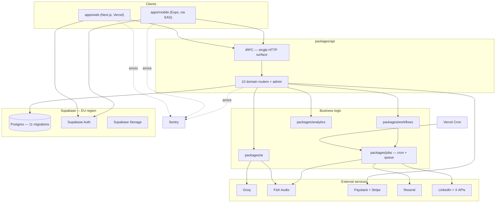

# PostStreak — System Design (Stage 7 of 8)

Status: **Scaffolded, pending founder review.** Synthesis document — no new stub source files this stage, this pulls Stages 1–6 into one picture and resolves the cross-cutting infrastructure decisions no single stage owned. Planning artifact, not a build artifact; nothing here has been provisioned.

Lives at the repo root deliberately — every other stage doc sits next to the code it governs, but this one is explicitly about how all of those pieces fit together, so no single folder is the right home for it.

---

## 1. Decisions confirmed this stage (founder answers, 2026-08-14)

- **Three environments** — dev / staging / prod, each its own Supabase project.
- **Mobile ships via EAS Build + OTA updates** — Expo Application Services for store builds, Expo Updates for JS-only changes without a store review cycle.
- **Sentry** for error tracking and alerting, across web, mobile, and the API layer — nothing was covering this before.
- **Supabase region: Europe** (Frankfurt or London) — closest available region to West Africa; AWS, which Supabase runs on, has no Africa region.

## 2. System architecture

Everything left of `packages/api` in this diagram is a client with no direct database access — the "no secret in the mobile bundle" boundary from Stage 2 holds for web too. Every arrow into `Data` or `External` originates from `packages/api`, `packages/ai`, or `packages/jobs`, never from `Clients` directly.

## 3. Deployment topology

| Layer | Where | Notes |
|---|---|---|
| `apps/web` | Vercel | Hosts the Next.js app, the tRPC API surface, and Vercel Cron triggers |
| `apps/mobile` | EAS (Expo Application Services) | Native builds submitted to App Store/Play Store; JS-only changes ship via Expo Updates (OTA), no store review needed |
| Data | Supabase, EU region | Postgres, Auth, Storage — one project per environment |
| Cron | Vercel Cron | Triggers `packages/jobs`' dispatch functions |
| Errors | Sentry | One project, environment-tagged, covering web + mobile + API |

## 4. Environments

Three Supabase projects — dev, staging, prod — each with its own connection string, its own Vercel environment variables, and its own EAS build profile. Migrations (`supabase/migrations/`) apply to all three in the same order; nothing in this design allows dev and prod schemas to drift independently. Staging is the last gate before production — it's where a release candidate runs against production-shaped data volume before real users see it.

## 5. Operational requirements not owned by any single stage

- **Connection pooling.** Vercel's serverless functions must use Supabase's pooled connection string (Supavisor), not a direct Postgres connection — serverless's cold-start-heavy connection pattern will exhaust Postgres's connection limit otherwise. This isn't a tradeoff, it's a correctness requirement for this specific hosting combination.
- **Secrets.** Server-side secrets (Supabase service role, Groq, Fish Audio, Paystack/Stripe secret keys, Resend, LinkedIn/X app secrets) live in Vercel environment variables, scoped per environment. `apps/mobile` build config via EAS Secrets holds only what's genuinely safe to ship client-side (the Supabase anon key, the API base URL) — consistent with Stage 2's "no secret in the mobile bundle" boundary, which this doesn't relax.
- **Backups & recovery.** Doc3's security baseline (§65) explicitly requires "secure backups and tested restoration." Production needs Supabase's automated backups enabled at minimum, point-in-time recovery if the plan tier supports it, and an actual periodic restore test — not just backups that have never been verified to restore cleanly.
- **Region tradeoff, named plainly.** Europe is the closest available region, not a local one — Lagos-to-Frankfurt/London latency is real, just better than any alternative AWS region. Worth re-measuring once real usage data exists rather than assuming it's fine indefinitely.

## 6. Security posture — synthesis, not new decisions

Pulling together what's already been decided across Stages 1–6, plus what's still open:

| Concern | Status |
|---|---|
| RLS policy philosophy | **Resolved — Stage 8.** Strict RLS everywhere + security-definer functions for narrow cross-user reads. See DATA_MODEL.md item F. No policies are actually written yet — that's implementation, not this session's job — but every table now has a governing philosophy instead of none. |
| Auth model | Decided — dual cookie (web) / bearer token (mobile), one resolution path (`packages/api/context.ts`) |
| Secrets boundary | Decided — server-only, never in the mobile bundle (§5 above) |
| Payment webhook verification | **Not yet designed** — `routers/billing.ts` notes webhooks are handled separately from tRPC procedures, but signature verification itself isn't specified anywhere. Flagged below, not solved here. |
| Rate limiting / abuse control | Decided — DB-backed counters (Stage 2 item L) |
| Staff access control | Decided — flat `staff_admin` role, audit-logged via `user_sanctions` (Stage 6) |
| Moderation | Decided — AI-assisted flagging, human-only enforcement (Stage 4) |

RLS is the one gap in this table that blocks real implementation, not just a nice-to-have — every table in `supabase/migrations/` is currently wide open by default until that policy is written.

## 7. Assumptions & flagged decisions

| # | Item | Status | Detail |
|---|---|---|---|
| Z | Webhook signature verification | **OPEN** | Paystack and Stripe webhooks need signature verification before their payloads are trusted — not designed in any stage so far. Real security gap if left unresolved before billing goes live. |
| AA | CI/CD pipeline detail | **NOT DESIGNED** | This stage names the deployment targets (Vercel, EAS) but doesn't design what runs on PR vs. merge vs. release tag. Deliberately left for whoever sets up the actual tooling — a planning session isn't the place to hand-author a CI config. |

## 8. Explicitly out of scope this pass

Actual Vercel/Supabase/EAS project provisioning, CI pipeline YAML, Sentry project setup, or any other real tooling — all of that is the "getting hands dirty" work this entire session has deliberately stayed out of. This stage designs the topology; it doesn't stand it up.

## 9. Next

Feeds Stage 8 (OPEN_QUESTIONS) directly — this stage adds two new open items (webhook verification, CI/CD detail) to the running list from every prior stage: Jarvis state count and color, RLS philosophy, source-file provenance, onboarding depth, quests placement, duel end condition, billing renewal policy, and the revenue-metric join.

**Waiting for "approved, continue" (or corrections) before starting Stage 8: OPEN_QUESTIONS.** *(Approved 2026-08-14.)*
